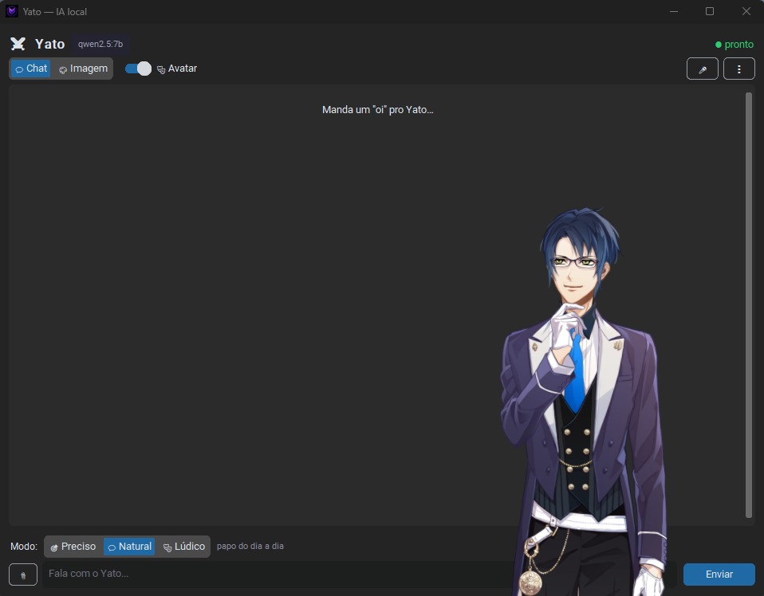
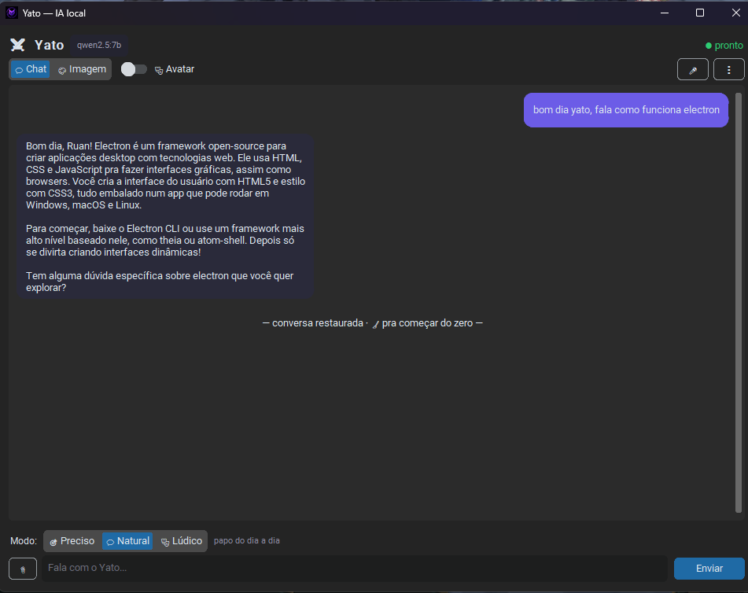
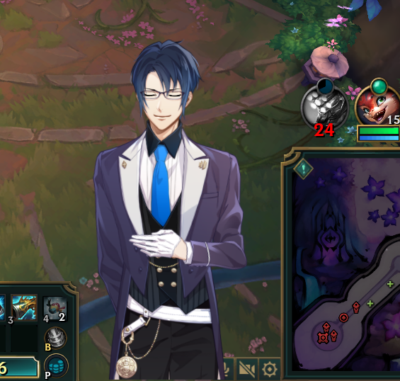
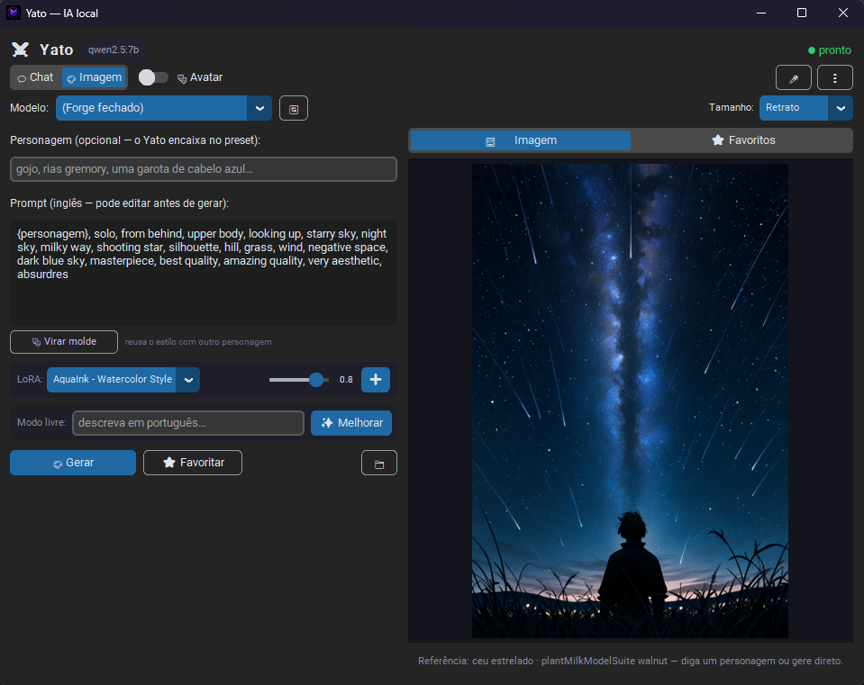
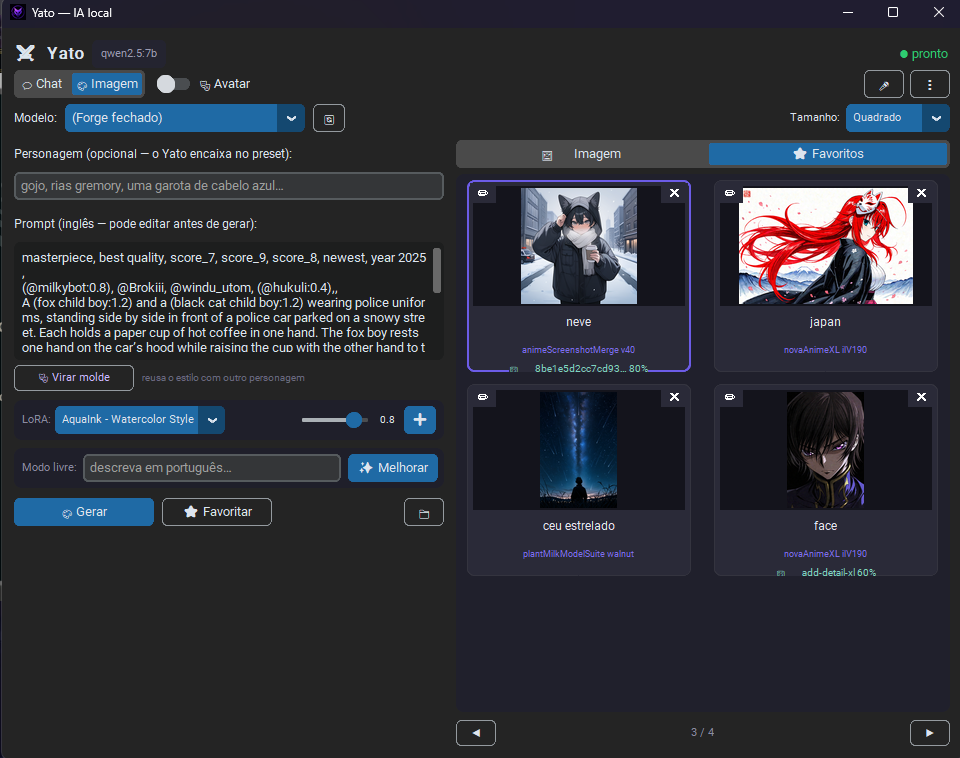

<h1 align="center">Yato — assistente de IA 100% local</h1>

<p align="center">
  <em>Chat com personalidade, voz, ouvido, visão, avatar Live2D e estúdio de imagem —<br>
  tudo rodando <strong>na sua máquina</strong>, sem nenhuma API paga e sem mandar seus dados pra nuvem.</em>
</p>

<p align="center">
  
  
  
  
  
</p>

<p align="center">
  
</p>

---

## O que é

O **Yato** é um assistente de desktop (Windows) com personalidade própria, construído
do zero em Python. A regra do projeto é uma só: **tudo roda localmente** — o cérebro é
um modelo aberto na GPU via [Ollama](https://ollama.com), a voz é sintetizada na CPU,
o ouvido transcreve offline e as imagens são geradas pelo Stable Diffusion na sua placa.
Zero chave de API, zero mensalidade, zero dado seu saindo da máquina.

Nasceu como projeto de estudo — **abrir a caixa-preta da IA** e entender tokens,
contexto, temperatura e streaming na prática — e cresceu, rodada a rodada, até virar
um assistente completo.

## ✨ O que ele faz

### 💬 Conversa (e age)

<p align="center">
  
</p>

Não é só um chat: o Yato é um **agente**. Ele decide sozinho quando precisa de suas
"mãos" — **busca na web** (DuckDuckGo, sem chave), **lê páginas**, **anota fatos sobre
você** (memória permanente entre sessões) e **enxerga imagens** que você cola no chat
(um segundo modelo, `qwen2.5vl`, funciona como "olho emprestado" do cérebro cego).

- Respostas em **streaming** (a geração token a token, visível);
- **Modos de conversa** que ensinam ML na prática: 🎯 Preciso / 💬 Natural / 🎭 Lúdico
  são temperaturas (0.2 / 0.7 / 1.2) com nome de gente;
- **Métricas em cada resposta**: tokens, tempo, velocidade da GPU e temperatura usada;
- **Histórico de conversas** com rotação + memória de fatos em JSON legível;
- Defesa contra **prompt injection**: texto de página é informação, nunca ordem.

### 🔊 Fala e ouve 🎤

O Yato **lê as respostas em voz alta** com o [Piper](https://github.com/rhasspy/piper)
(TTS offline, na CPU, voz pt-BR) e **ouve o microfone** com o
[faster-whisper](https://github.com/SYSTRAN/faster-whisper) — aperte 🎤, fale, e a
transcrição vira mensagem. Nenhum áudio sai da sua máquina.

### 🎭 Avatar Live2D flutuante

<p align="center">
  
</p>

Um personagem **Live2D** que respira, pisca e faz **lip-sync de verdade**: o `voz.py`
mede a força do som em janelas de ~55 ms e a boca acompanha as sílabas. A janela é um
processo **Electron** à parte com **fundo transparente real** — só o personagem flutua
por cima do que você estiver fazendo (na foto, uma partida de League of Legends 😄) —
controlado pelo Python via ponte HTTP local.

### 🎨 Estúdio de imagem

<p align="center">
  
</p>

Geração de imagem local com o [Forge](https://github.com/lllyasviel/stable-diffusion-webui-forge)
(Stable Diffusion / SDXL) — e um fluxo de trabalho pensado pra quem itera de verdade:

- **Biblioteca de moldes (favoritos)**: salve um prompt bom junto da imagem de
  referência. O molde tem um slot `{personagem}` — você digita só o personagem
  em português, o cérebro traduz pra tag e **injeta no lugar certo**, mantendo
  cena, estilo e qualidade do molde;
- **🎭 Virar molde**: transforma qualquer prompt num molde reutilizável em duas
  camadas — o LLM tira o nome do personagem e um **filtro determinístico** remove
  aparência e temas de cor (porque modelo 7B é ruim em *apagar* tags — quando uma
  etapa não é confiável no modelo, ela vira código);
- **Seletor de LoRA** com peso ajustável — troque o estilo da arte por geração;
- **Revezamento de VRAM**: Ollama (~5 GB) e SDXL (~6–7 GB) não cabem juntos em
  8 GB — antes de gerar, o Yato manda o cérebro soltar a GPU e o recupera depois;
- O Yato **abre o Forge sozinho** se estiver fechado (e espera o boot).

<p align="center">
  
</p>

## 🧠 Arquitetura

Cada módulo tem uma responsabilidade só — dá pra testar o cérebro sem abrir a janela:

```
app.py (a janela — CustomTkinter)
   │
   ├─► cerebro.py ──HTTP──► Ollama :11434 ──► qwen2.5:7b na GPU
   │       └─► ferramentas.py  (busca web · ler página · ver imagem · anotar fatos)
   │
   ├─► personalidade.py  (quem o Yato é — o system prompt)
   ├─► memoria.py        (conversas + fatos, JSON com leitura segura)
   ├─► voz.py            (Piper TTS, offline)  ──► lip-sync ──┐
   ├─► ouvido.py         (faster-whisper, offline)            │
   ├─► avatar2d.py ──HTTP──► avatar-electron/ :8137  (Live2D transparente)
   ├─► imagem.py  ──HTTP──► Forge :7860  (Stable Diffusion / SDXL + LoRA)
   └─► presets.py        (a biblioteca de moldes com slot {personagem})
```

## 🔩 Stack (e o porquê de cada peça)

| Peça | Tecnologia | Por quê |
| ---- | ---------- | ------- |
| Cérebro | Ollama + `qwen2.5:7b` | Modelo aberto que cabe em 8 GB de VRAM e suporta ferramentas (agente) |
| Olho | `qwen2.5vl:7b` | Venceu o teste cego de leitura de tela (12/12 itens vs 11/12 do gemma3) |
| Interface | CustomTkinter | Janela nativa leve, sem navegador embutido |
| Voz | Piper (`faber-medium` pt-BR) | TTS offline na CPU — não disputa a GPU com o cérebro |
| Ouvido | faster-whisper (small) | Transcrição offline na CPU, mesma lógica |
| Avatar | Electron + pixi-live2d-display | O único jeito de fundo **transparente de verdade** no Windows 11 |
| Imagem | Forge (SDXL / Illustrious) | API local `--api`, mesmo espírito do Ollama: HTTP sem chave |

**Hardware de referência:** RTX 4060 Ti (8 GB VRAM) + 16 GB RAM. Os 8 GB são o teto
que moldou o projeto inteiro — modelos 7B, visão e imagem se **revezando** na GPU em
vez de coexistir.

## 🚀 Instalação

```powershell
# pré-requisitos: Python 3.12+ e Ollama instalados
cd yato-py
python preparar.py   # cria o .venv, instala tudo, baixa voz e modelo
```

Depois é duplo-clique no **`Iniciar Yato.bat`**. O guia completo (instalação manual,
troca de modelo, ajustes finos e o roadmap detalhado de todas as rodadas) está no
**[README do yato-py](yato-py/README.md)**.

> A geração de imagem pede o [Forge](https://github.com/lllyasviel/stable-diffusion-webui-forge)
> instalado à parte (com a flag `--api`) — o Yato o abre sozinho quando você manda desenhar.

## 📂 Os dois projetos deste repositório

| Pasta | O que é |
| ----- | ------- |
| [`yato-py/`](yato-py/) | **A versão atual** — o assistente completo descrito acima |
| [`yato-mini/`](yato-mini/) | A primeira versão: chat web em React + Vite (o começo da jornada) |

## 🗺️ Roadmap

O projeto evolui em **rodadas** — cada uma vira um commit com nome claro. Já foram 12
(robustez → laboratório de ML → streaming → agente com busca → memória → visão →
histórico → voz → avatar Live2D → ouvido → geração de imagem → biblioteca de moldes).
Próximas ideias: importar prompts do Civitai via API, triggers automáticos de LoRA e,
o chefão final, **trocar o Ollama por código que roda o modelo direto**.

## 📜 Licença

[MIT](LICENSE) — use, estude e adapte à vontade.

---

<p align="center">
  Feito por <a href="https://github.com/RodrigoRuan2">Rodrigo Ruan</a> — aprendendo IA na prática, uma rodada de cada vez. 💜
</p>
